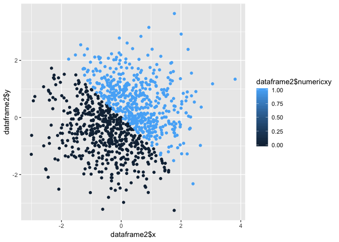
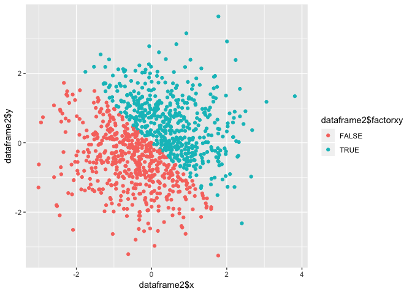

P8105\_hw1\_jl5172
================

``` r
#A random sample of size 10 from a uniform[0, 5] distribution
#the runif function provide information about the uniform distribution on the interval from min to max. In this case #sample size is 10,min=0 max=5 
#A logical vector indicating whether elements of the sample are greater than 2
#compare each elements in vector compare2 to 2 one by one. If an element is greater than 2 R will return TRUE otherwise it will return FALSE
#A (length-10) character vector 
#A (length-10) factor vector
# the vector named student contains set of numeric codes with character-valued levels
library(tidyverse)
```

    ## ── Attaching packages ───────────────────────────────────────────────────────────── tidyverse 1.2.1 ──

    ## ✔ ggplot2 3.0.0     ✔ purrr   0.2.5
    ## ✔ tibble  1.4.2     ✔ dplyr   0.7.6
    ## ✔ tidyr   0.8.1     ✔ stringr 1.3.1
    ## ✔ readr   1.1.1     ✔ forcats 0.3.0

    ## ── Conflicts ──────────────────────────────────────────────────────────────── tidyverse_conflicts() ──
    ## ✖ dplyr::filter() masks stats::filter()
    ## ✖ dplyr::lag()    masks stats::lag()

``` r
set.seed(1)
dataframe1=tibble(
random10=runif(10,0,5),  
logical2=c(random10>2),character10=c("a","b","c","d","e","f","g","h","i","j"),
factor10=factor(c(1,0,1,1,0,1,0,0,1,1),levels = c(0,1),labels = c("male","female")))

mean(dataframe1$random10)
```

    ## [1] 2.757569

``` r
mean(dataframe1$logical2)
```

    ## [1] 0.6

``` r
mean(dataframe1$character10)
```

    ## Warning in mean.default(dataframe1$character10): argument is not numeric or
    ## logical: returning NA

    ## [1] NA

``` r
mean(dataframe1$factor10)
```

    ## Warning in mean.default(dataframe1$factor10): argument is not numeric or
    ## logical: returning NA

    ## [1] NA

``` r
# According to the output. Mean can be taken from random10(numeric) and logical2(numeric) 
#but not character10(character) and factor10(factor) since mean function is designed for numeric/logical vectors
```

``` r
as.numeric(dataframe1$logical2)
```

    ##  [1] 0 0 1 1 0 1 1 1 1 0

``` r
as.numeric(dataframe1$character10)  
```

    ## Warning: NAs introduced by coercion

    ##  [1] NA NA NA NA NA NA NA NA NA NA

``` r
as.numeric(dataframe1$factor10)
```

    ##  [1] 2 1 2 2 1 2 1 1 2 2

``` r
# the factor vector and logical vector have been successfully converted to numeric. However, character vector was not able to be converted
```

``` r
character10<-as.factor(dataframe1$character10)
character10<-as.numeric(character10)
# the character vector has been sucessfully converted to numeric.
factor10<-as.character(dataframe1$factor10)
factor10<-as.numeric(factor10)
```

    ## Warning: NAs introduced by coercion

``` r
# Warning message is shown. "NAs introduced by coercion"
```

inline code
-----------

``` r
library(tidyverse)
set.seed(1)

dataframe2 = tibble(
x = rnorm(1000, sd =1),
y = rnorm(1000,sd =1),
logicxy = c((x+y)>0),
numericxy=as.numeric(logicxy),
factorxy=as.factor(logicxy))
```

The mean of x is -0.0116481 The median of x is -0.0353242 The proportion of cases for which logical vector is TRUE is 490

Scatterplot Logical Variable

``` r
ggplot(dataframe2, aes(x = dataframe2$x, y = dataframe2$y,color=dataframe2$logicxy)) + geom_point()
```


Scatterplot Numeric variable

``` r
ggplot(dataframe2, aes(x = dataframe2$x, y = dataframe2$y,color=dataframe2$numericxy)) + geom_point()
```



Scatterplot Factor variable

``` r
ggplot(dataframe2, aes(x = dataframe2$x, y = dataframe2$y,color=dataframe2$factorxy)) + geom_point()
```


